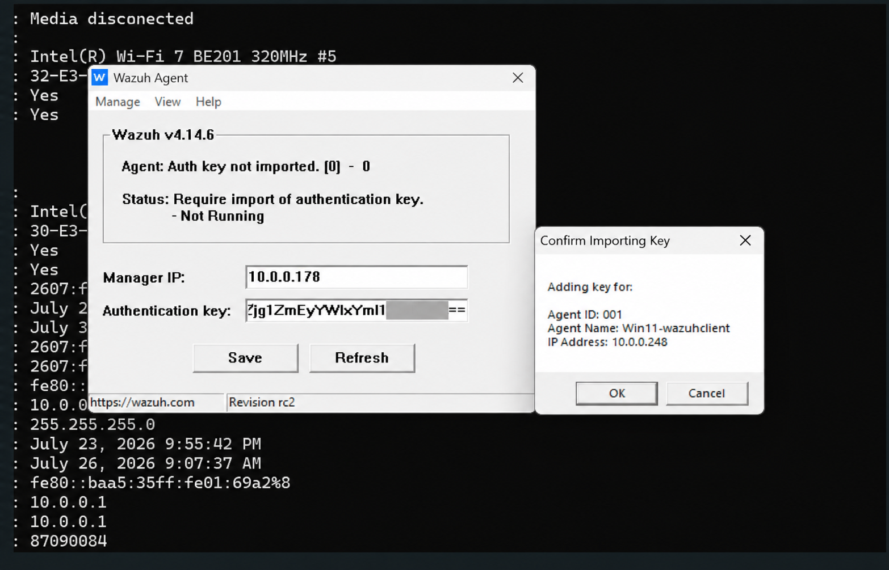
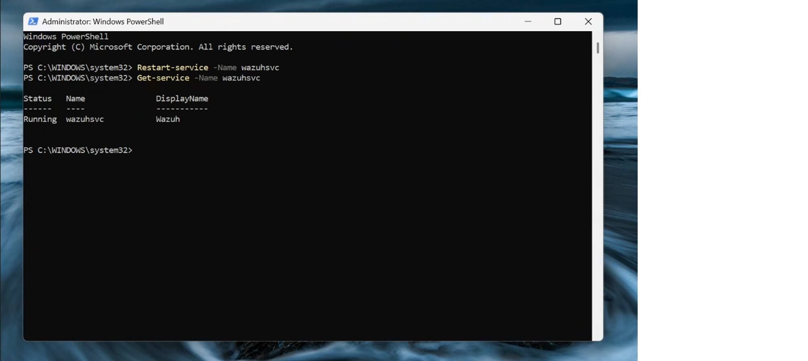
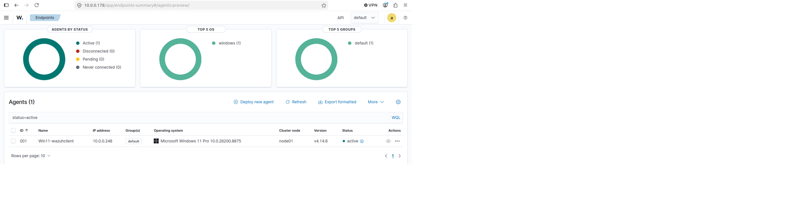

# Windows 11 Wazuh Agent Deployment

## Overview

After deploying the Wazuh Manager, the next stage of the lab involved
installing and registering a Wazuh Agent on a Windows 11 endpoint.

The Wazuh Agent allows the Windows endpoint to send security telemetry
and system information to the Wazuh Manager for centralized monitoring,
analysis, and alerting.

## Environment

| Component | Configuration |
|---|---|
| Endpoint Operating System | Windows 11 |
| Endpoint Security Agent | Wazuh Agent |
| Management Platform | Wazuh Manager |
| Manager Operating System | Ubuntu Linux |
| Virtualization | VMware |

## Step 1 - Add a New Agent in Wazuh

From the Wazuh Dashboard, the agent deployment process was started by
selecting the option to deploy a new agent.

The Windows operating system was selected as the target platform.

The Wazuh Manager address was then specified so that the endpoint would
know where to send its security information.

## Step 2 - Install the Wazuh Agent

The Wazuh Agent installation command generated by the Wazuh Dashboard
was executed on the Windows 11 endpoint using PowerShell with
administrative privileges.

The installation package installed the Wazuh Agent and configured it
to communicate with the Wazuh Manager.

> Security Note: Environment-specific credentials, authentication keys,
> or other sensitive information should not be published in a public
> GitHub repository.
> ### Agent Configuration Evidence



*Windows 11 Wazuh Agent configured to communicate with the Wazuh Manager. The authentication key has been redacted for security.*

## Step 3 - Start the Wazuh Agent Service

After installation, the Wazuh Agent service was started on the
Windows endpoint.

The following PowerShell command can be used to start the service:

```powershell
NET START WazuhSvc
```

Starting the service allows the Wazuh Agent to establish communication
with the Wazuh Manager.

### Agent Service Verification


*PowerShell verification confirming that the Wazuh Agent service is running on the Windows 11 endpoint.*

## Step 4 - Verify Agent Connectivity

The Wazuh Dashboard was used to verify that the Windows 11 endpoint
successfully connected to the Wazuh Manager.

A successfully registered agent provides the Wazuh Manager with
visibility into the endpoint and enables security monitoring features.

### Agent Connectivity Verification



*Wazuh Dashboard confirming that the Windows 11 endpoint is successfully registered and actively communicating with the Wazuh Manager.*

## Monitoring Capabilities

With the Windows endpoint connected, the lab environment could be used
to monitor and investigate:

- Windows security events
- Authentication activity
- File integrity changes
- Security configuration findings
- Endpoint vulnerabilities
- Wazuh security alerts

## Deployment Verification

The agent deployment was considered successful after confirming that:

- The Wazuh Agent was installed on Windows 11
- The Wazuh Agent service was running
- The endpoint could communicate with the Wazuh Manager
- The Windows endpoint appeared in the Wazuh Dashboard
- The agent reported an active status

## Result

The Windows 11 endpoint was successfully integrated into the Wazuh
monitoring environment.

This established centralized endpoint monitoring between the Windows
workstation and the Ubuntu-based Wazuh Manager.

## Next Step

With endpoint monitoring established, the next stage of the lab
involved generating and detecting controlled security events using
Wazuh File Integrity Monitoring.
