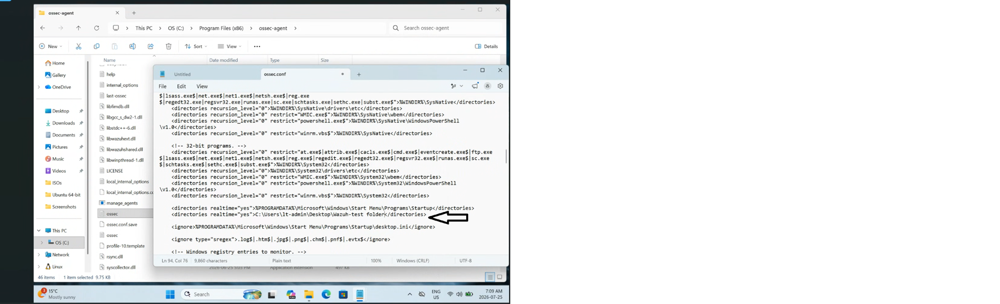
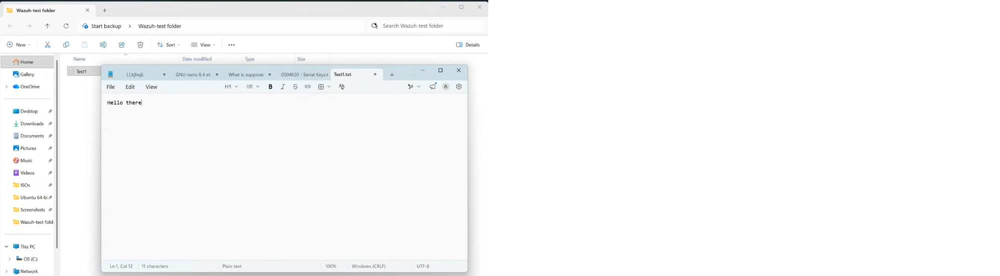
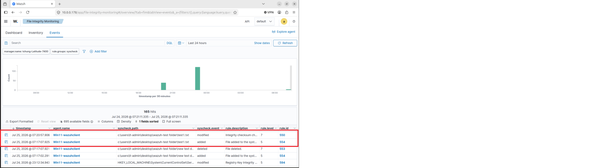

# File Integrity Monitoring (FIM)

## Overview

This stage of the Wazuh EDR home lab demonstrates File Integrity Monitoring (FIM) on the Windows 11 endpoint.

Wazuh File Integrity Monitoring can detect changes to monitored files and directories, providing visibility into file creation, modification, and deletion activity.

## Objective

The objectives of this test were to:

- Configure a directory for file integrity monitoring
- Create a controlled test file
- Modify the test file
- Verify that Wazuh detected the file system changes
- Investigate the generated events in the Wazuh Dashboard

## Test Environment

| Component | Configuration |
|---|---|
| Endpoint | Windows 11 |
| Endpoint Agent | Wazuh Agent |
| Manager | Wazuh Manager |
| Manager OS | Ubuntu Linux |
| Monitoring Feature | File Integrity Monitoring |
| Test Directory | `C:\Wazuh-FIM-Test` |

## Test Methodology

A dedicated test directory was created on the Windows 11 endpoint.

The directory was added to the Wazuh Agent File Integrity Monitoring configuration.

Controlled file operations were then performed to determine whether Wazuh successfully detected changes within the monitored directory.

---

## Step 1 - Configure File Integrity Monitoring

The Wazuh Agent configuration was configured to monitor the dedicated test directory on the Windows 11 endpoint.

The monitored directory used for the test was:

```text
C:\Wazuh-FIM-Test
```

Real-time monitoring was enabled so that changes made within the directory could be detected by the Wazuh Agent and reported to the Wazuh Manager.

### FIM Configuration Evidence



*Wazuh Agent configuration showing the directory configured for File Integrity Monitoring.*

---

## Step 2 - Create and Modify the Test File

A controlled test file was created inside the monitored directory.

The test file was then modified to generate file system activity that could be detected by Wazuh File Integrity Monitoring.

### Test File Activity



*Controlled test file activity performed within the directory monitored by Wazuh.*

---

## Step 3 - Verify File Integrity Monitoring Events

The Wazuh Dashboard was used to investigate File Integrity Monitoring events generated by the Windows 11 endpoint.

The test was designed to verify that Wazuh could identify file system changes occurring within the monitored directory.

### FIM Detection Evidence



*Wazuh File Integrity Monitoring events generated from activity within the monitored directory.*

---

## Expected Result

Wazuh should generate File Integrity Monitoring events when files inside the monitored directory are created, modified, or deleted.

## Results

The controlled File Integrity Monitoring test demonstrated that changes within the monitored Windows directory could be detected and reviewed through Wazuh.

The generated FIM events provided visibility into file system activity occurring on the monitored endpoint.

## Skills Demonstrated

- Wazuh File Integrity Monitoring
- Endpoint security monitoring
- Windows endpoint configuration
- Wazuh Agent configuration
- Security event analysis
- File system change detection
- Security monitoring and validation

## Conclusion

This test demonstrated the use of Wazuh File Integrity Monitoring to monitor file system activity on a Windows 11 endpoint.

By configuring a dedicated monitoring directory and performing controlled file operations, the lab demonstrated how file changes can be detected and investigated through the Wazuh Dashboard.
