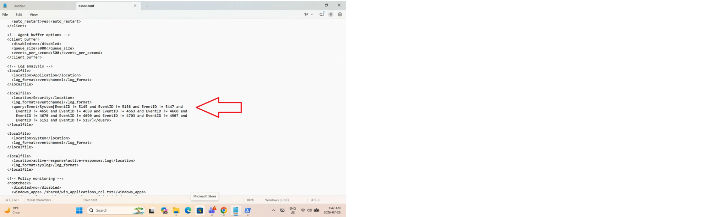
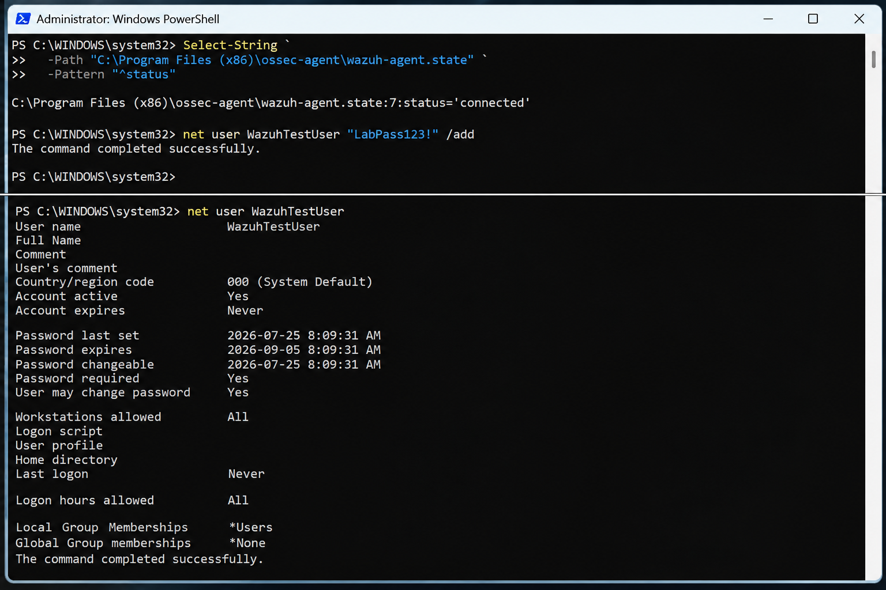
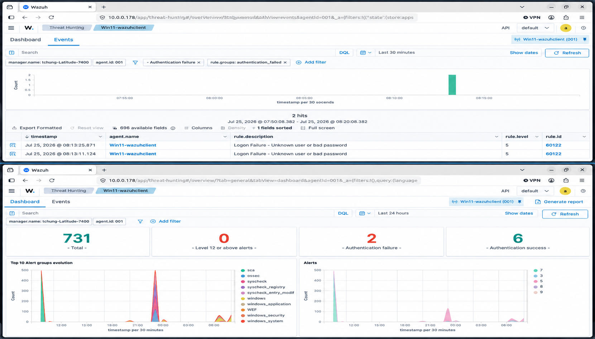

# Failed Windows Logon Detection

## Overview

This stage of the Wazuh EDR home lab demonstrates the detection and investigation of failed Windows authentication attempts.

Windows records unsuccessful logon attempts in the Security event log. The Wazuh Agent can collect these security events and forward them to the Wazuh Manager for analysis and investigation.

## Objective

The objectives of this test were to:

- Configure Wazuh to monitor Windows Security events
- Create a controlled test user account
- Generate failed authentication attempts
- Confirm that Wazuh detected the failed authentication activity
- Investigate the generated events in the Wazuh Dashboard

## Test Environment

| Component | Configuration |
|---|---|
| Endpoint | Windows 11 |
| Endpoint Agent | Wazuh Agent |
| Manager | Wazuh Manager |
| Manager OS | Ubuntu Linux |
| Log Source | Windows Security Event Log |
| Windows Event ID | 4625 |
| Test Type | Controlled failed authentication attempt |

---

## Step 1 - Configure Windows Security Event Monitoring

The Wazuh Agent configuration file was reviewed to confirm that Windows Security events were being collected.

The following event channel configuration was used:

```xml
<localfile>
  <location>Security</location>
  <log_format>eventchannel</log_format>
</localfile>
```

This allows the Wazuh Agent to collect events from the Windows Security event log.

### Configuration Evidence



*Wazuh Agent configuration used for monitoring Windows Security events.*

---

## Step 2 - Create a Controlled Test Account

A temporary local Windows account named `WazuhTestUser` was created for the authentication test.

The account provided a controlled environment for generating failed authentication attempts without using a normal user account.

The Wazuh Agent was also verified as connected before performing the test.

### Test Account Evidence



*Temporary Windows test account used for the controlled failed authentication test.*

---

## Step 3 - Generate Failed Authentication Attempts

Failed logon attempts were intentionally generated using the temporary `WazuhTestUser` account and an incorrect password.

The purpose of the test was to determine whether the Windows authentication failures would be collected and detected by Wazuh.

Windows recorded the failed authentication activity as Security Event ID `4625`.

---

## Step 4 - Investigate the Events in Wazuh

The Wazuh Dashboard was used to investigate the authentication activity generated during the test.

Wazuh detected two authentication failures associated with the controlled test.

The event view identified the activity as:

```text
Logon Failure - Unknown user or bad password
```

### Detection Evidence



*Wazuh Dashboard showing the failed authentication events detected during the controlled test.*

---

## Results

The failed Windows logon detection test was successful.

Two controlled authentication failures were detected by Wazuh. The test demonstrated that Windows authentication activity could be collected from the endpoint and investigated through the Wazuh Dashboard.

## Security Relevance

Monitoring failed authentication attempts can help security teams identify potentially suspicious account activity.

Repeated authentication failures may be associated with:

- Password guessing
- Brute-force attempts
- Unauthorized access attempts
- Misconfigured applications or services
- Compromised credentials being tested

Authentication events should be investigated alongside other endpoint and network telemetry to determine whether the activity represents a legitimate user error or a potential security incident.

## Skills Demonstrated

- Windows authentication monitoring
- Windows Security Event Log analysis
- Wazuh endpoint monitoring
- Security event investigation
- Failed logon detection
- Windows Event ID 4625 analysis
- Controlled security testing
- EDR/SIEM alert investigation

## Conclusion

This test demonstrated Wazuh's ability to monitor and identify failed Windows authentication activity.

By generating controlled failed logon attempts with a temporary test account, the lab demonstrated how authentication failures can be collected from a Windows endpoint and investigated through the Wazuh Dashboard.
