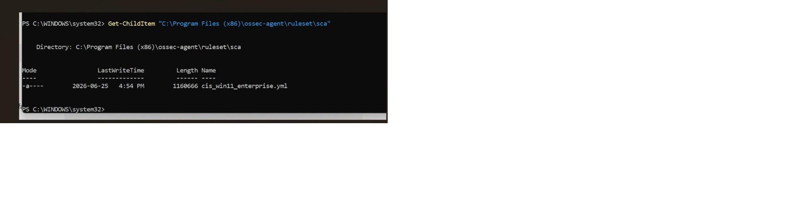
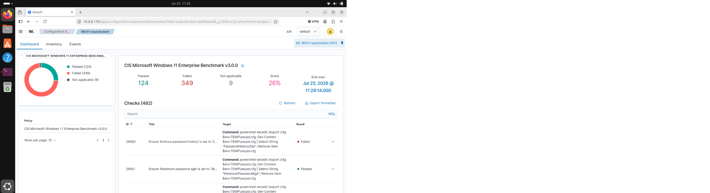

# Security Configuration Assessment (SCA)

## Overview

This stage of the Wazuh EDR home lab demonstrates the use of Wazuh Security Configuration Assessment (SCA) to evaluate the security configuration of the Windows 11 endpoint.

Wazuh SCA performs configuration checks against security policies and benchmarks, allowing potential configuration weaknesses and compliance issues to be identified.

## Objective

The objectives of this assessment were to:

- Verify the SCA policy available on the Windows 11 endpoint
- Review the Security Configuration Assessment results
- Evaluate the endpoint against the applicable CIS benchmark
- Identify security configuration weaknesses
- Understand how configuration weaknesses can increase endpoint security risk

## Test Environment

| Component | Configuration |
|---|---|
| Endpoint | Windows 11 |
| Endpoint Agent | Wazuh Agent |
| Manager | Wazuh Manager |
| Manager OS | Ubuntu Linux |
| Assessment Feature | Security Configuration Assessment (SCA) |
| Security Benchmark | CIS Microsoft Windows 11 Enterprise Benchmark v3.0.0 |

---

## Step 1 - Verify the SCA Policy

Wazuh provides Security Configuration Assessment policies with the endpoint agent.

The available SCA policy files on the Windows 11 endpoint were verified using PowerShell:

```powershell
Get-ChildItem "C:\Program Files (x86)\ossec-agent\ruleset\sca"
```

The Wazuh Agent service was then restarted to trigger a new assessment:

```powershell
Restart-Service wazuhsvc
```

### SCA Policy Verification



*PowerShell verification of the Security Configuration Assessment policy available to the Wazuh Agent.*

---

## Step 2 - Review the SCA Results

The Wazuh Dashboard was used to review the Security Configuration Assessment results for the Windows 11 endpoint.

The endpoint configuration was evaluated against the:

**CIS Microsoft Windows 11 Enterprise Benchmark v3.0.0**

The assessment produced a score of **26%**.

The result indicated that many of the recommended security hardening controls were not configured according to the CIS benchmark.

### SCA Dashboard Results



*Wazuh Security Configuration Assessment results for the Windows 11 endpoint.*

---

## Assessment Results

The Security Configuration Assessment identified opportunities to improve the security configuration of the Windows 11 endpoint.

The 26% assessment score does not indicate that the endpoint was compromised. Instead, it indicates that many recommended hardening controls were not configured according to the CIS benchmark.

Examples of security areas evaluated by the benchmark include:

- Password policies
- Auditing
- Firewall configuration
- Account restrictions
- Windows security settings

## Security Relevance

Security Configuration Assessment helps identify insecure or non-compliant system configurations.

Configuration weaknesses can increase the attack surface of an endpoint and may make systems more susceptible to unauthorized access, privilege abuse, credential attacks, or other security threats.

Using established security benchmarks provides a structured approach for evaluating and improving endpoint security configurations.

## Skills Demonstrated

- Wazuh Security Configuration Assessment
- CIS security benchmark analysis
- Windows endpoint security assessment
- Security configuration review
- Endpoint hardening analysis
- Security posture assessment
- PowerShell administration
- Wazuh Dashboard investigation

## Conclusion

The Security Configuration Assessment demonstrated how Wazuh can evaluate a Windows endpoint against an established security benchmark.

The assessment identified areas where the Windows 11 endpoint did not meet recommended CIS hardening controls, providing a baseline for identifying potential security configuration improvements.
