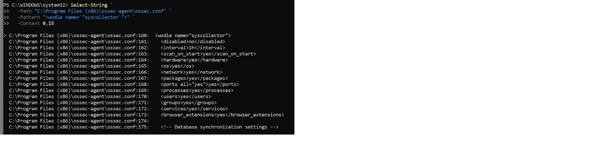

# Vulnerability Detection

## Overview

This stage of the Wazuh EDR home lab demonstrates the Vulnerability Detection capability of Wazuh.

Wazuh can collect software inventory from the Windows endpoint and compare installed software versions with vulnerability information to help identify potentially vulnerable applications.

## Objective

The objectives of this assessment were to:

- Verify that Syscollector was enabled on the Windows 11 endpoint
- Confirm that Wazuh could collect software inventory information
- Review vulnerability information through the Wazuh Dashboard
- Identify vulnerable or outdated software
- Understand how vulnerability findings can support remediation activities

## Test Environment

| Component | Configuration |
|---|---|
| Endpoint | Windows 11 |
| Endpoint Agent | Wazuh Agent |
| Manager | Wazuh Manager |
| Manager OS | Ubuntu Linux |
| Inventory Component | Syscollector |
| Security Feature | Vulnerability Detection |

---

## Step 1 - Verify Syscollector

The Wazuh Agent configuration was reviewed to verify that Syscollector was enabled on the Windows 11 endpoint.

The following PowerShell command was used:

```powershell
Select-String `
 -Path "C:\Program Files (x86)\ossec-agent\ossec.conf" `
 -Pattern "<wodle name=`"syscollector`">" `
 -Context 0,15
```

The configuration contained:

```text
<disabled>no</disabled>
```

This confirmed that Syscollector was enabled.

The Wazuh Agent service was then restarted:

```powershell
Restart-Service wazuhsvc
```

### Syscollector Verification



*PowerShell verification showing that Syscollector was enabled on the Windows 11 Wazuh Agent.*

---

## Step 2 - Review Vulnerability Detection

The Wazuh Dashboard was used to access the Vulnerability Detection capability.

Wazuh used software inventory information collected from the endpoint to identify installed software associated with known vulnerabilities.

During the lab, the Vulnerability Detection results identified vulnerable or outdated software requiring further investigation.

The assessment identified **one critical vulnerability** that required prioritization for remediation.

The recommended response was to:

- Confirm that the affected software was installed
- Investigate the identified vulnerability
- Update the affected software where appropriate
- Remove the affected package if it was no longer required

> **Evidence note:** The original lab report documented the Vulnerability Detection findings, including the critical vulnerability, but a separate dashboard screenshot was not available.

---

## Results

The vulnerability assessment demonstrated that Wazuh could use endpoint software inventory information to identify potential security weaknesses.

The lab identified vulnerable or outdated software and highlighted one critical vulnerability for further investigation and remediation.

## Security Relevance

Vulnerability detection provides visibility into known vulnerabilities that may affect monitored endpoints.

Identifying vulnerable software allows administrators and security analysts to prioritize remediation activities such as patching, upgrading, or removing affected applications.

This helps reduce the attack surface of an endpoint and the risk associated with known software vulnerabilities.

## Skills Demonstrated

- Wazuh Vulnerability Detection
- Endpoint software inventory collection
- Syscollector configuration verification
- Vulnerability identification
- Vulnerability remediation analysis
- Windows PowerShell
- Endpoint security monitoring
- Security risk prioritization

## Conclusion

This assessment demonstrated how Wazuh can use endpoint inventory information to support vulnerability identification and remediation.

Syscollector was verified as enabled on the Windows 11 endpoint, and the Vulnerability Detection capability identified vulnerable software requiring investigation.

The exercise demonstrated how endpoint monitoring and vulnerability management can work together to improve the overall security posture of a system.
